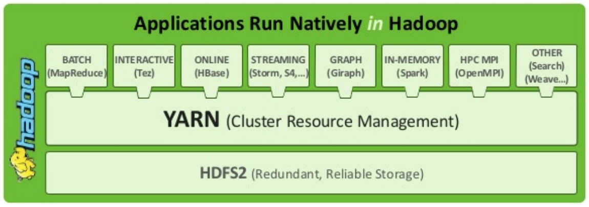
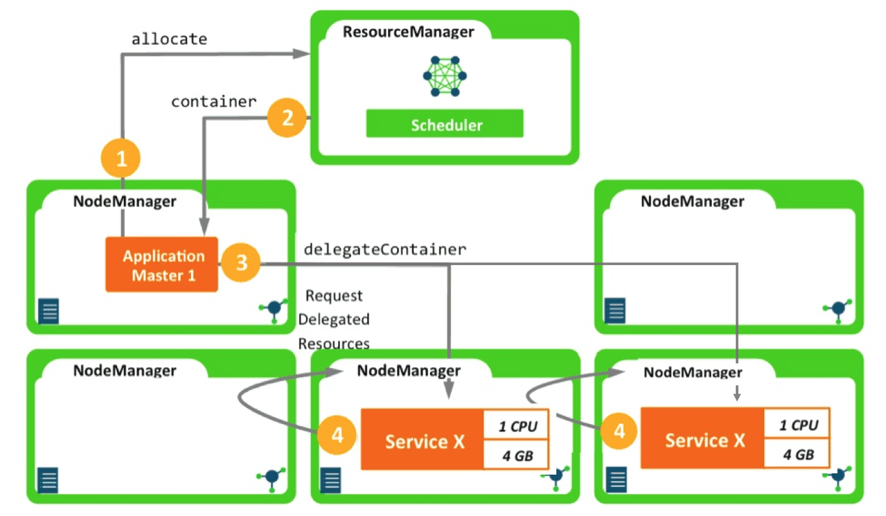

# Service oriented application hosted on YARN demo

## 1. 介绍
[Apache Hadoop Yarn](http://hadoop.apache.org/)是big data领域通用的资源管理与调度平台，很多计算框架均可以跑在Yarn上，例如Mapreduce、Spark、Flink、Storm等，这些计算框架可以专注于计算本身，Yarn提供的高度抽象的接口来做集成。



除了big data以外，实际一些长服务（long time running service）也可以跑在Yarn上，这里做了一些探索。这个项目就可以把service跑在Yarn上

如下图，`service x`通过Yarn维持固定跑2个实例。




## 2. 搭建Hadoop环境
必备环境包括HDFS、YARN。

如果读者已经有了Hadoop环境，请跳过此节。如果没有，可以参考下面的docker环境本地搭建。
https://github.com/iceqiw/bigdata-docker

## 3. 代码说明

为支持通过YARN做资源管理、调度以及应用高可用保证，可以参考下面的类，做定制。

| 类名    | 路径      | 作用     |
| -------------- | ------------ | -------------- |
| SampleExecutor            | [Link](https://github.com/iceqiw/app-on-yarn-demo/blob/dev/src/main/java/com/neoremind/app/on/yarn/demo/SampleExecutor.java)      |  用户自定义的执行主引擎，例如上述的跑一个HTTP服务，YARN会在container中跑这个类       |
| SampleHttpServer            | [Link](https://github.com/iceqiw/app-on-yarn-demo/blob/dev/src/main/java/com/neoremind/app/on/yarn/demo/SampleHttpServer.java)      |  用户自定义的一个例子，集成Jetty       |
| Constants            | [Link](https://github.com/iceqiw/app-on-yarn-demo/blob/dev/src/main/java/com/neoremind/app/on/yarn/demo/Constants.java)      |  包括静态变量，YARN Container跑Java类的main class       |

另外两个重要的类如下，无需修改。

| 类名    | 路径      | 作用     |
| -------------- | ------------ | -------------- |
| ApplicationMaster            | [Link](https://github.com/iceqiw/app-on-yarn-demo/blob/dev/src/main/java/com/neoremind/app/on/yarn/demo/ApplicationMaster.java)      |  YARN ApplicationMaster程序       |
| Client            | [Link](https://github.com/iceqiw/app-on-yarn-demo/blob/dev/src/main/java/com/neoremind/app/on/yarn/demo/Client.java)      |  YARN Client程序       |

Client是用于提交YARN上运行程序的入口，通过命令行其参数如下。下面的demo **4.5**中会有例子。
```
usage:
 -appname <arg>                                 Application Name. Default
                                                value - DistributedShell
 -container_memory <arg>                        Amount of memory in MB to
                                                be requested to run the
                                                shell command
 -container_vcores <arg>                        Amount of virtual cores to
                                                be requested to run the
                                                shell command
 -debug                                         Dump out debug information
 -help                                          Print usage
 -jar_path <arg>                                Jar file containing the
                                                application master in
                                                local file system
 -jar_path_in_hdfs <arg>                        Jar file containing the
                                                application master in HDFS
 -java_opts <arg>                               Java opts for container
 -keep_containers_across_application_attempts   Flag to indicate whether
                                                to keep containers across
                                                application attempts. If
                                                the flag is true, running
                                                containers will not be
                                                killed when application
                                                attempt fails and these
                                                containers will be
                                                retrieved by the new
                                                application attempt
 -log_properties <arg>                          log4j.properties file
 -master_memory <arg>                           Amount of memory in MB to
                                                be requested to run the
                                                application master
 -master_vcores <arg>                           Amount of virtual cores to
                                                be requested to run the
                                                application master
 -memory_overhead <arg>                         Amount of memory overhead
                                                in MB for application
                                                master and container
 -num_containers <arg>                          No. of containers on which
                                                the shell command needs to
                                                be executed
 -priority <arg>                                Application Priority.
                                                Default 0
 -queue <arg>                                   RM Queue in which this
                                                application is to be
                                                submitted
 -shell_args <arg>                              Command line args for the
                                                shell script.Multiple args
                                                can be separated by empty
                                                space.
 -shell_env <arg>                               Environment for shell
                                                script. Specified as
                                                env_key=env_val pairs
 -timeout <arg>                                 Application timeout in
                                                milliseconds
```
